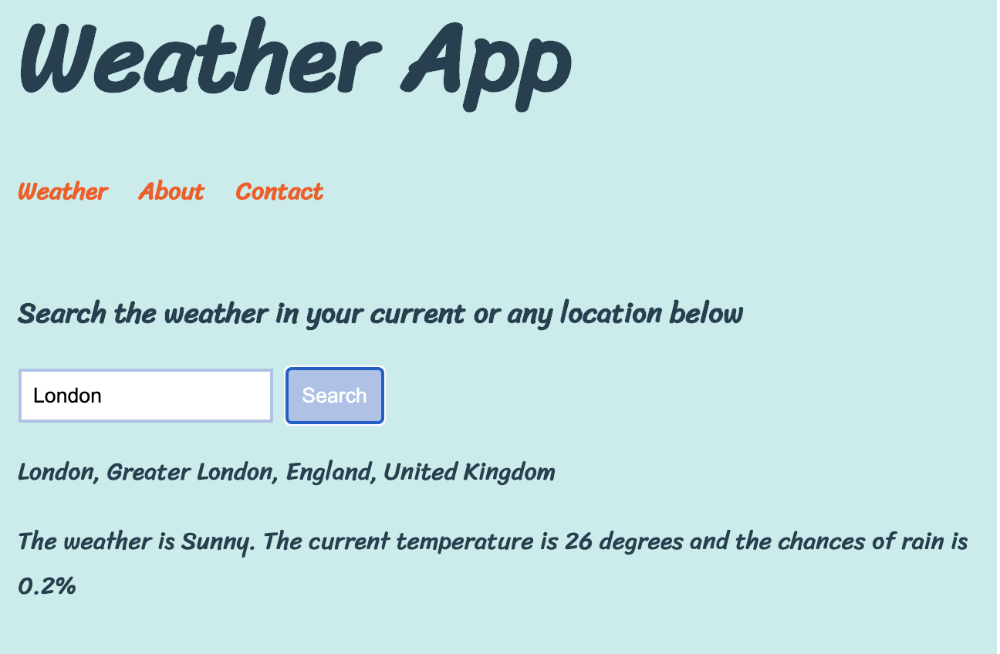
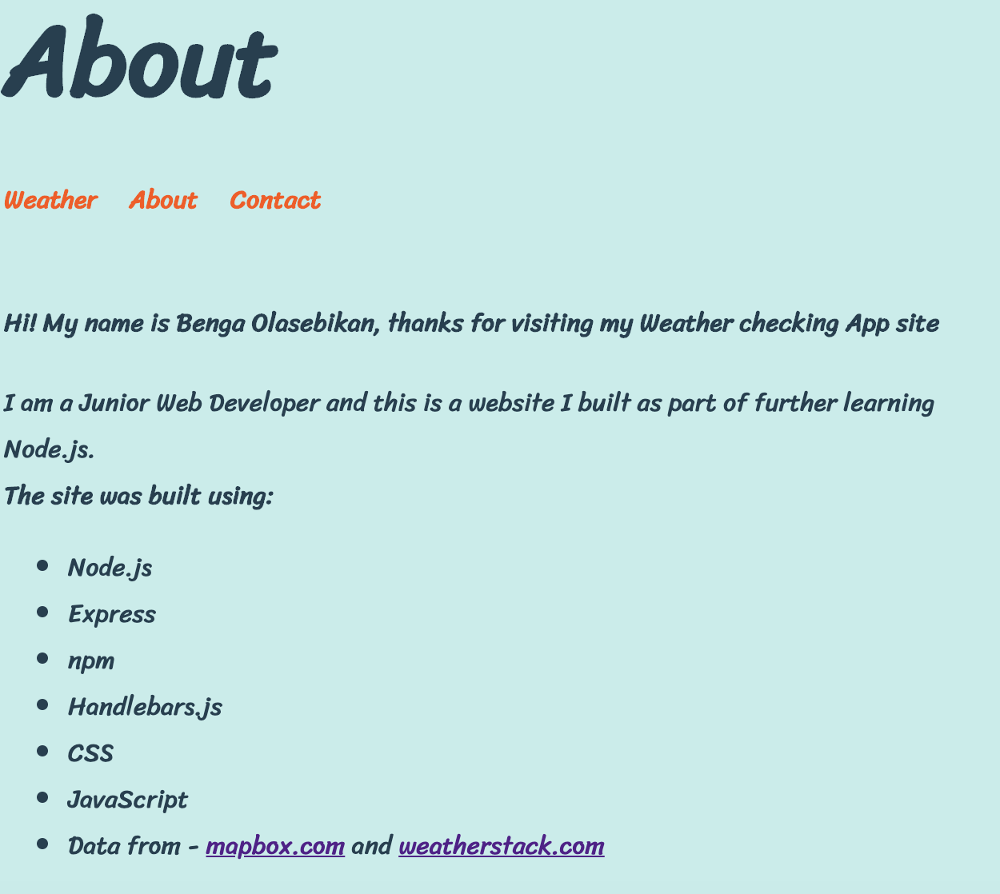

# WEATHER APP

This is an app I built whilst doing further learning about Node.js and Express.

The objective of the App is for it to provide you with the current weather of any location you search for using data from weatherstack.com

# Timeframe - One day

# Technologies used - Node.js, Express, npm, Handlebars.js, CSS, JavaScript and Data from mapbox.com and weatherstack.com

As mentioned, this is an app I built in a day as part of my further learning.

I had prior knowledge and experience with node and express etc but I wanted to delve deeper. This was interesting however, as I got to learn more about callback functions, fetching data and most especially I learned about how to render html to the browser using Handlebars, something I had never seen before but was able to get used to pretty quickly

My first task was finding the Weather API I wanted to use and understanding their docs. weatherstack.com is popular and looks straightforward to understand so I opted for it.
I then proceeded to fetch the data passing in different locations to the search query to ensure it works and it was returning json data.  Once I was satisfied, I then wrote my code requesting the data using a callback I just learned

Once the above was completed, I used the same approach to fetch the latitude and longitude of the Users search location from mapbox.com to be able to later pass as an argument to the weather search query.

Both of my functions to fetch data from the weatherstack.com and mapbox.com API now work which I am happy with. I now need to connect it to my local server. I used npm to install the express package and required it in my app.js file before then setting up the connection to listen out for my local port.



The next step is now to set up the route points for my app using the CRUD methods, mainly the get method though as I am only displaying information for the user to read. This was very interesting as it was ther first time I had come across the res.render method to render data to the browser via html, like below:
The next step is now to set up the route points for my app using the CRUD methods, mainly the get method though as I am only displaying information for the user to read. This was very interesting as it was the first time I had come across the res.render method to render data to the browser via html, like below:

```
 app.get('/about', (req, res) => {
  res.render('about', {
    title: 'About',
    name: 'Benga Olasebikan', 
    profession: 'Junior Web Developer'
  })
})
```



I now have all my route points setup and able to succesfully fetch my data. I just now need to display it to the user. I downloaded Handlebars.js once again using npm before setting it up in the app.js file to interact with the templates folder. I spent some time learning the syntax for handlebars, which was straightforward and to an extent similar to react in the way its written. 
My route points are setup and able to succesfully fetch my data. It is time to display it to the user. I downloaded Handlebars.js once again using npm before setting it up in the app.js file to interact with the templates folder. I spent some time learning the syntax for handlebars, which was straightforward and to an extent similar to react in the way its written. 

# Key Learnings:

Helped improve my previous understanding node.js and express a lot by learning the foundations and fundamentals by hard coding a lot of things without using any 3rd party libraries and packages.

I also learned about Handlebars.js which was a totally new concept to me.


